<div align="center">

# Carvv

**weave ideas into visual stories**

An AI research-to-carousel studio. Idea, link or document in,
researched, art-directed, publish-ready story out.

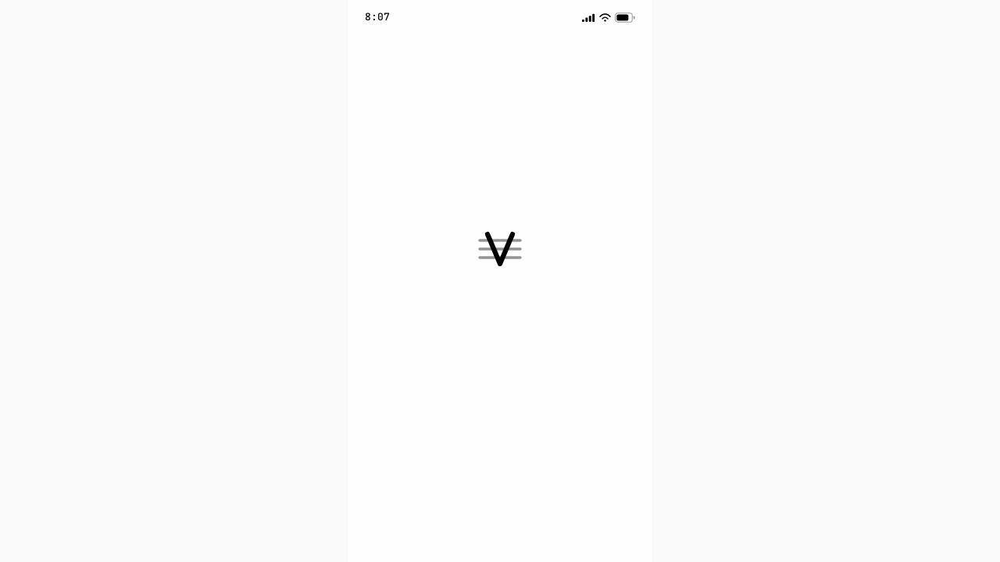


</div>

---

## What Carvv is

Most tools turn text into slides. Carvv does the opposite of a template
machine: it **reads the material first**, finds the story inside it,
decides what deserves to be *shown* (a statistic becomes a chart,
causality becomes a diagram, a process becomes a numbered sequence),
then art-directs every slide individually: rhythm, density, accent,
crop. It ships with a storyboard, a canvas editor with undo/redo, a QA
critic, a caption studio, real-scale Instagram and LinkedIn feed
previews, and a scroll-stop score that reacts to every edit.

The chrome is deliberately quiet: paper-white, pill geometry, hairline
cards, one black CTA, zero shadows. All the colour lives inside the work
being made. The one handwritten voice (Caveat) is reserved for the art
director's margin notes.

## The screens

These are the actual product screens, captured from the running
application. The implementation reproduces the supplied design mockup
pixel-faithfully: same spacing, typography, colours, states and flow.

<table>
  <tr>
    <td width="33%">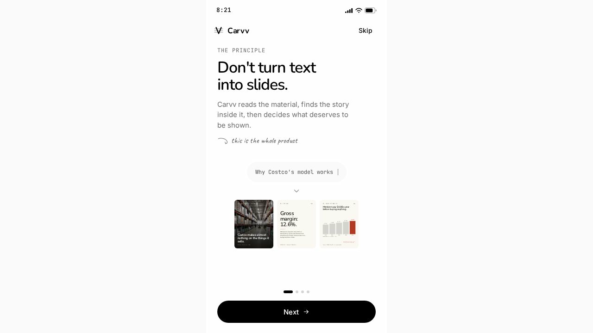<br/><sub><b>Onboarding</b> · the principle, in four panes</sub></td>
    <td width="33%">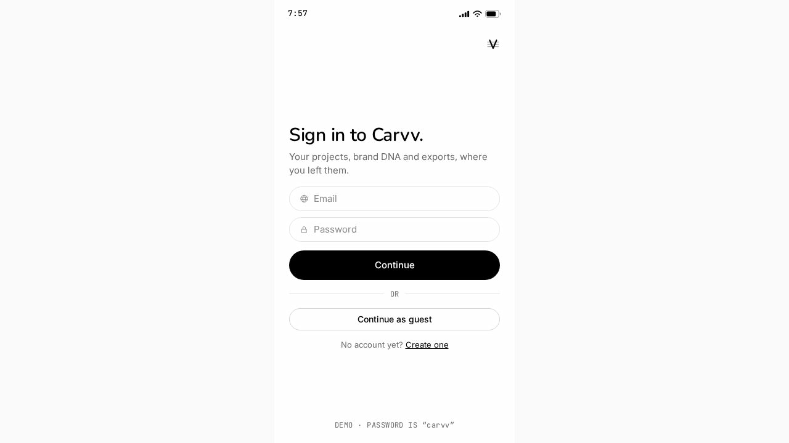<br/><sub><b>Auth</b> · email + 6-digit code, or guest</sub></td>
    <td width="33%">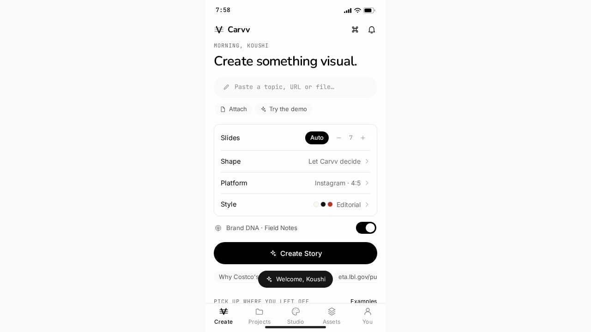<br/><sub><b>Create</b> · the carve pill: topic, URL or file</sub></td>
  </tr>
  <tr>
    <td>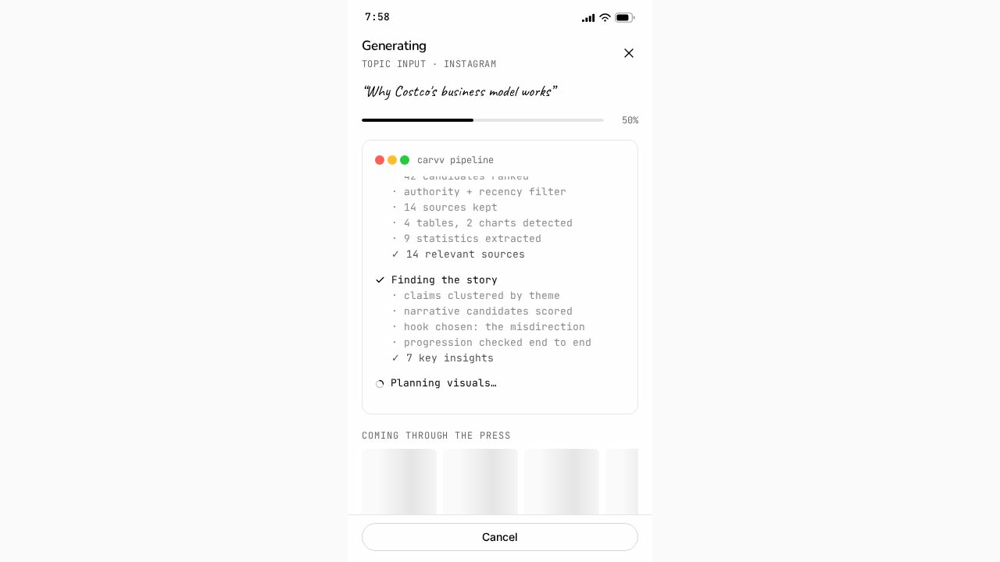<br/><sub><b>Generating</b> · the traffic-light pipeline log</sub></td>
    <td>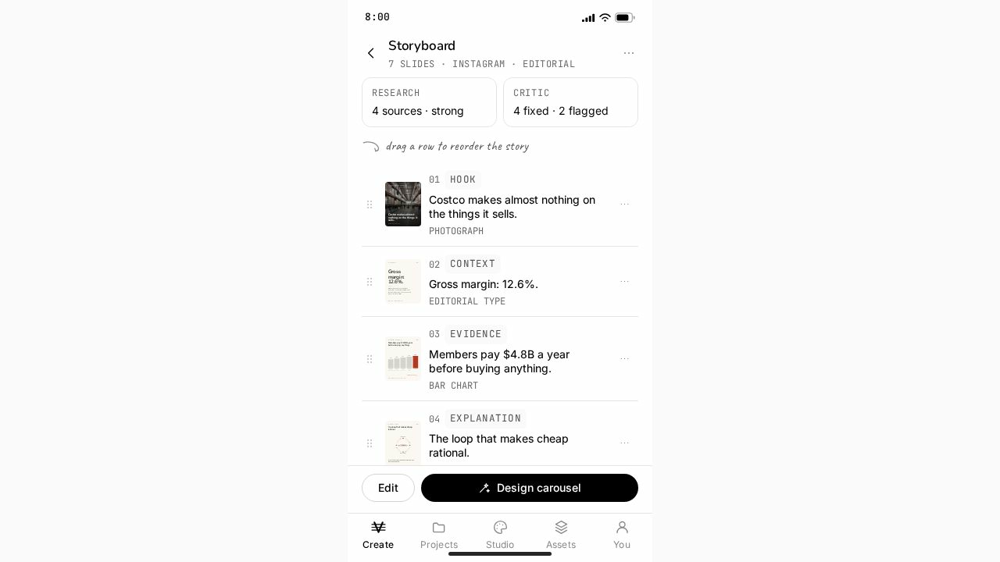<br/><sub><b>Storyboard</b> · drag to reorder the story</sub></td>
    <td>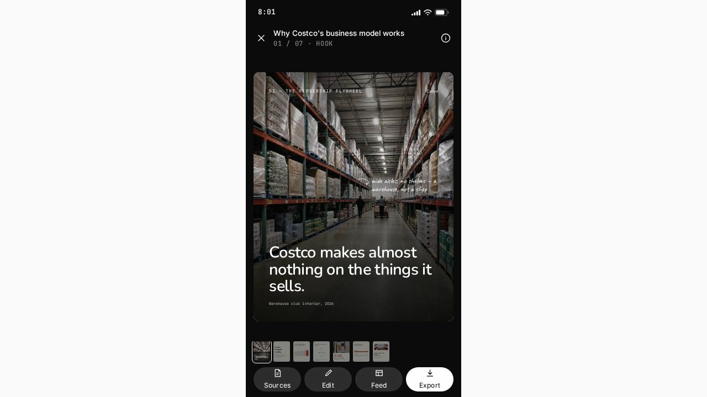<br/><sub><b>Viewer</b> · full-bleed slides, dark chrome</sub></td>
  </tr>
  <tr>
    <td>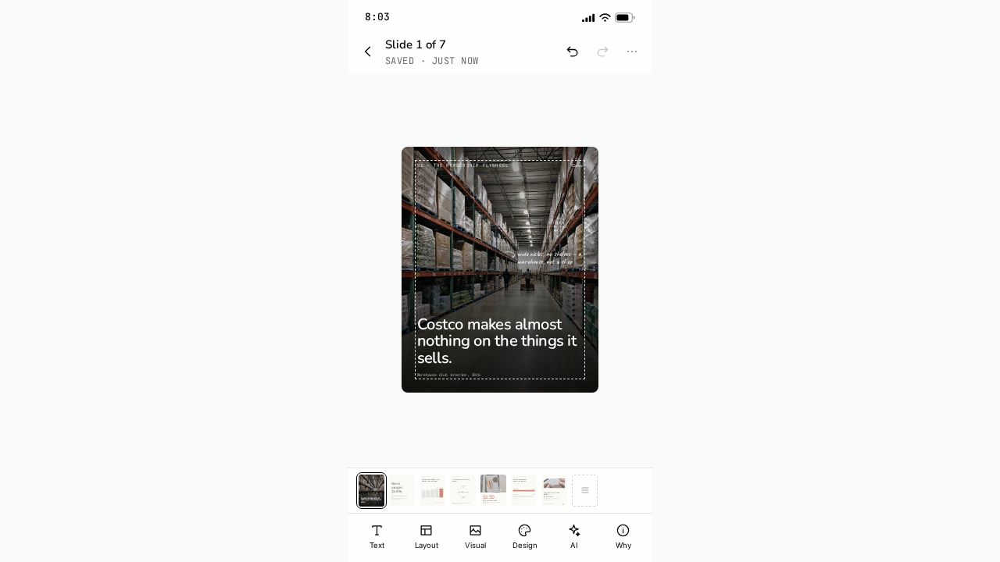<br/><sub><b>Editor</b> · canvas, safe areas, AI commands</sub></td>
    <td>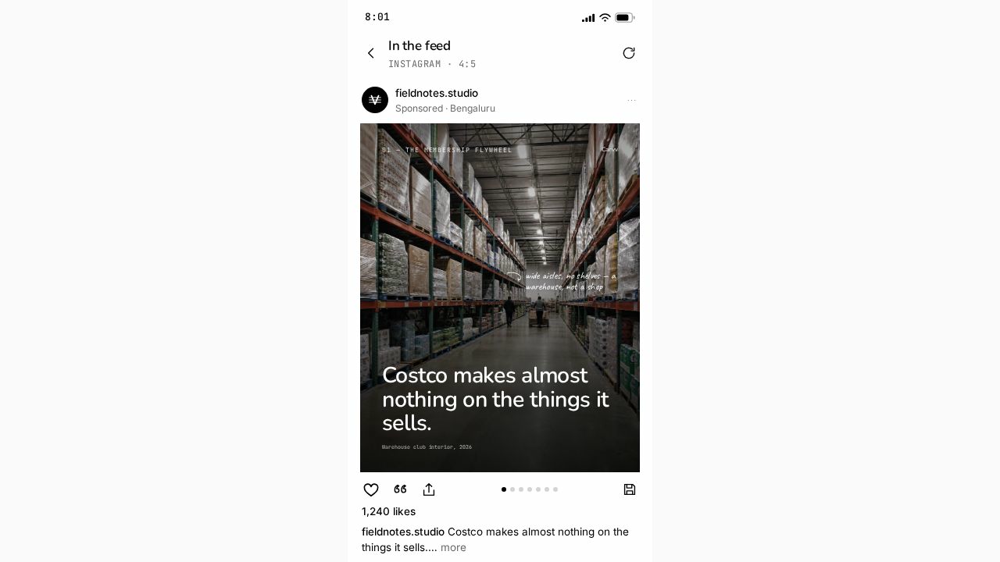<br/><sub><b>Feed preview</b> · real-scale Instagram mock</sub></td>
    <td>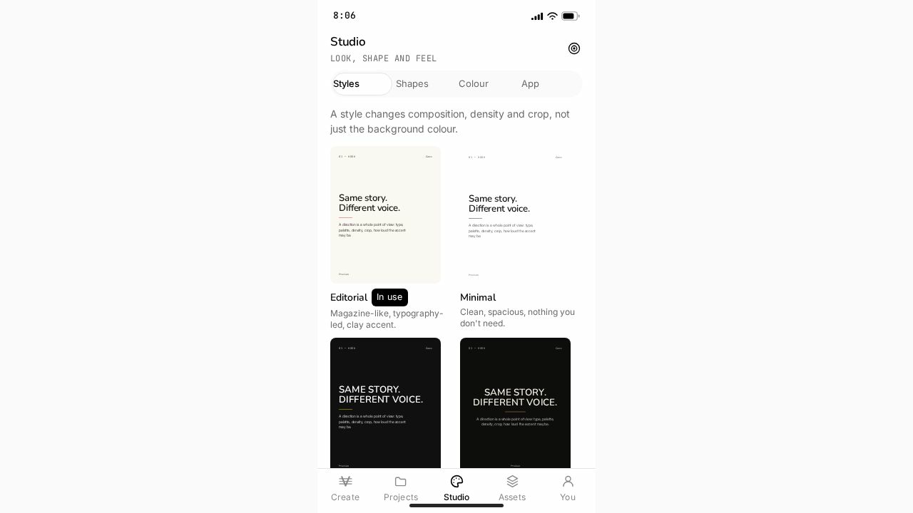<br/><sub><b>Studio</b> · style gallery, shapes, colour</sub></td>
  </tr>
  <tr>
    <td>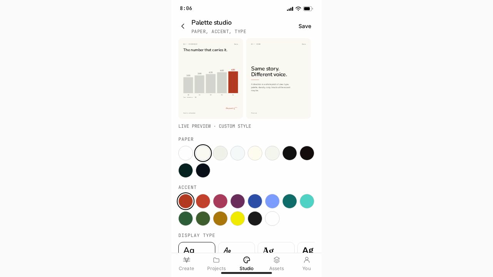<br/><sub><b>Palette studio</b> · live contrast-safe palettes</sub></td>
    <td></td><td></td>
  </tr>
</table>

## Feature tour

- **Research-first pipeline** — paste a topic, a URL, an article or a
  document. Topics run a real web search first; the top pages are
  fetched live and stripped (nav, ads, cookie banners); statistics keep
  a receipt you can open in the Research panel.
- **Story shapes** — 9 narrative blueprints (business breakdown, myth vs
  fact, how it works, data story, timeline, ranking, case study,
  quote-led, adaptive). A shape is a constraint, not a skin: it
  genuinely re-orders and re-layouts the story.
- **Art direction, per slide** — 8 style presets, 10 curated palettes, a
  palette studio with live WCAG contrast grading and a display-type
  picker (Nunito, Caveat, Fraunces, Archivo, JetBrains Mono).
- **The editor** — canvas with safe-area guides, filmstrip, per-slide AI
  commands (make it more visual, reduce the text, turn this into a
  comparison), full undo/redo with labelled history.
- **The critic** — a QA pass that flags unsourced claims, long headlines
  and placeholder data before you export.
- **Caption studio** — hook / body / CTA written from the slide specs,
  tone rewrites, hashtag sets, per-slide alt text, character budgets.
- **Real-scale feed previews** — Instagram and LinkedIn mocks with the
  caption crop, so the first slide earns the tap.
- **Scroll-stop score** — hook, variety, economy and evidence, recomputed
  on every edit.
- **Four chrome themes, seven accents** — paper, sand, ink and slate,
  applied app-wide without touching the work.
- **Real export** — every slide is rendered off-screen by the same
  engine the viewer uses, then downloaded as PNGs, a single PDF, or a
  zip package with captions, alt text, sources and the story spec.
- **Cloud sync** — projects, assets, brand DNA, preferences and palettes
  sync to Appwrite per user, with row-level security.

## Architecture

```
┌────────────────────────────┐         ┌──────────────────────────────┐
│  Client (React 18 + Vite)  │         │  Server (Express, server/)   │
│                            │  /api   │                              │
│  screens · slides · lib    ├────────▶│  GET  /api/search  (cheerio) │
│  store (context)           │         │  GET  /api/scrape  (cheerio) │
│  services/pipeline (local  │         │  POST /api/ai/story          │
│  editorial brain, always   │         │  rate limits · security hdrs │
│  available as fallback)    │         └────────┼─────────────────────┘
│  services/export (real PNG ├────────┐          ▼
│  · PDF · zip rendering)    │        │  OpenRouter  nvidia/nemotron-3-
└────────────┬───────────────┘        │  ultra-550b-a55b:free
             │ appwrite sdk           │  DuckDuckGo HTML (search,
             ▼                        │  keyless, server-side)
   Appwrite Cloud project "carvv"
   Auth (email+password, email code, anonymous)
   Database carvv-db: projects · profiles · assets
```

Design rules that keep it robust:

- **The OpenRouter key never leaves the server.** The browser only talks
  to `/api/*`. `OPENROUTER_API_KEY` has no `VITE_` prefix, so it is
  never bundled.
- **Graceful degradation everywhere.** No Appwrite env: the app runs in
  its pixel-identical local demo mode. AI unreachable or slow: the
  built-in editorial pipeline produces the story instead, with zero
  visual difference. Search or scraping fails: generation proceeds from
  the prompt alone. Export capture fails on fonts: it retries with
  system fonts rather than dropping the job.
- **The model edits the specification, never the pixels.** AI output is
  validated and normalized into Carvv's slide spec; invalid chart
  layouts without real data are downgraded to type slides. Real fetched
  sources outrank whatever the model claims to have read.

## Tech stack

| Layer | Choice |
| --- | --- |
| UI | React 18, hand-rolled component kit (`src/lib/ui.jsx`), zero CSS frameworks |
| Build | Vite 5 |
| Backend platform | Appwrite Cloud (auth, sessions, TablesDB document sync) |
| AI | OpenRouter, model `nvidia/nemotron-3-ultra-550b-a55b:free` |
| API server | Node 18+ / Express 4 |
| Search + scraping | cheerio over native `fetch` (server-side, timeouts, retries, dedupe) |
| Export | html-to-image + jsPDF + JSZip, off the live Slide engine |
| Type | Nunito · Inter · JetBrains Mono · Caveat · Fraunces · Archivo |

## Project structure

```
the-carvv-app/
├── index.html                  app shell, favicon, meta
├── vite.config.js              dev proxy /api → :8787
├── package.json                one package, client + server
├── .env.example                every variable, documented
├── server/
│   └── index.js                /api/search · /api/scrape · /api/ai/story · static dist
├── src/
│   ├── main.jsx
│   ├── App.jsx                 device frame, router, tab bar, toasts
│   ├── styles.css              fonts, keyframes, the design tokens as CSS vars
│   ├── lib/
│   │   ├── tokens.js           colours, styles, platforms (mutable theme state)
│   │   ├── theme.js            4 chrome themes, 7 accents, palette maths
│   │   ├── store.jsx           app state + Appwrite hydration/sync
│   │   ├── appwrite.js         auth, session restore, account ops, document sync
│   │   ├── icons.jsx           the stroke icon set + the Carvv mark
│   │   └── ui.jsx              buttons, sheets, dialogs, notes, meters
│   ├── data/                   seed projects, assets, templates, scoring
│   ├── services/
│   │   ├── pipeline.js         the editorial brain (research → story → design)
│   │   ├── ai.js               server API client + slide-spec normalizer
│   │   └── export.jsx          real PNG / PDF / zip rendering
│   ├── screens/                boot · create · viewer · editor · library
│   │                           · studio · share · settings
│   ├── slides/SlideRenderer.jsx  the 13 layout renderers
│   └── assets/images.js        bundled photography (data URIs, hermetic build)
└── docs/screenshots/           the screens above, as text-wrapped images
```

## Getting started

**Requirements:** Node 18.17+, an Appwrite Cloud project, an OpenRouter
API key.

```bash
git clone https://github.com/KoushikNavuluri/thecarvvapp.git
cd thecarvvapp
cp .env.example .env      # fill in (below)
npm install
npm run dev               # client :5173 · api :8787
```

Open http://localhost:5173. On a desktop the app renders in its device
frame; on a phone it fills the screen.

> Fresh checkout note: run `npm install` (not `npm ci`) once so the
> lockfile picks up the export libraries, then commit the updated
> `package-lock.json`.

**Demo mode.** With no env configured the app still runs end to end
locally: sign in with any email and the password `carvv`, or continue
as guest. Generation then uses the built-in editorial pipeline.

## Environment variables

| Variable | Where | Purpose |
| --- | --- | --- |
| `VITE_APPWRITE_ENDPOINT` | client | Regional host, e.g. `https://nyc.cloud.appwrite.io/v1` — must match the project's region |
| `VITE_APPWRITE_PROJECT_ID` | client | the `carvv` project ID |
| `VITE_APPWRITE_DATABASE_ID` | client | `carvv-db` |
| `VITE_API_BASE` | client | blank in dev (proxy) or same-origin deploys |
| `OPENROUTER_API_KEY` | **server only** | your OpenRouter key |
| `OPENROUTER_MODEL` | server | defaults to `nvidia/nemotron-3-ultra-550b-a55b:free` |
| `PORT` | server | API port, default `8787` |
| `ALLOWED_ORIGIN` | server | optional, one extra CORS origin for split-host deploys |

Only `VITE_*` variables reach the browser bundle, and they contain no
secrets.

## Appwrite configuration

The app expects an Appwrite Cloud project named **`carvv`**. A working
instance is already provisioned as project `6ab22ff00001b59e3839`
(region **nyc**) with:

- **Auth**: email/password enabled (default). Sign-up uses a 6-digit
  email code (`createEmailToken` → `createSession`); guests use
  anonymous sessions. Sessions restore on launch (the splash waits for
  the restore to answer, then skips straight to the studio). Account &
  security shows the live session list with revoke, and password change
  calls `updatePassword` directly.
- **Database `carvv-db`** (TablesDB), row-level security on, table
  permission `create("users")` and per-row owner permissions:

| Table | Columns (beyond the row payload) |
| --- | --- |
| `projects` | `user_id`, `title`, `input_type`, `input_value`, `platform`, `style`, `template`, `status`, `cover`, `slides`, `sources`, `score`, `fresh`, `updated_label`, `payload`; key index `by_user` |
| `profiles` | `user_id` (unique index `by_user`), `brand`, `prefs`, `palette` |
| `assets` | `user_id`, `name`, `kind`, `type`, `asset_key`, `prov`, `used`, `dims`; key index `by_user` |

- **Platforms**: a web platform registered for hostname `localhost`.
  **When you deploy, add your production hostname** under
  Project → Platforms, or browser requests will be rejected.

To reproduce from scratch: create the project, create database
`carvv-db`, add the three tables with the columns above, enable row
security, register your web platforms, done.

## AI integration

`POST /api/ai/story` sends the topic (plus any real fetched material:
the scraped page, or search hits with their snippets) to
`nvidia/nemotron-3-ultra-550b-a55b:free` with a strict JSON contract:
title, sources with confidence, and 3 to 12 slides, each with a purpose
(HOOK → … → CONCLUSION), a layout, real chart data only when the source
contains real numbers, an editorial `insight` and the art director's
`why`. The client normalizes the answer into the slide spec the
renderers already speak, applies the chosen narrative shape, and the
generation screen's pipeline log reflects the real stages while it runs.

Change models any time via `OPENROUTER_MODEL`; no code changes.

## Data fetching, search & scraping

- `GET /api/search?q=…` runs a real web search (DuckDuckGo's keyless
  HTML endpoint, parsed server-side), normalizes results to
  `{ title, url, snippet, publisher }`, drops ads and dupes, caps at 8.
- `GET /api/scrape?url=…` retrieves a page in real time with a
  browser-grade user agent, retries once on 429/5xx, caps size and time,
  blocks private/internal hosts, and uses cheerio to strip nav, ads,
  cookie banners and consent walls. It returns structured content:
  `title`, `site`, `byline`, `published`, `description`, clean reading
  `text` (article/main preferred), word count, and up to 8 content
  `images` (og:image first, tiny icons filtered out).

The create flow chains them: a URL input is scraped directly; a topic
input is searched, its top results scraped, and the material handed to
the model as citable sources — which is why a generated story shows real
receipts in the Research panel instead of invented ones.

## Export

`src/services/export.jsx` renders each slide off a hidden copy of the
live `Slide` engine (identical output to the viewer), captures PNGs at
1x/2x/3x, then packages by format: individual PNG downloads, a paged
PDF, or a zip with slides, caption.txt, alt-text.txt, sources.txt and
the full story.json.

## Running in production

```bash
npm run build       # vite → dist/
npm start           # express serves dist/ + /api on :8787
```

One process serves everything, so any Node host works (Render, Railway,
a VPS, Fly.io). Server dependencies (express, cheerio, dotenv) are real
`dependencies`, so `--omit=dev` installs work. Set the env vars on the
host, add the public hostname as a web platform in Appwrite, and leave
`VITE_API_BASE` empty.

## Scripts

| Command | What it does |
| --- | --- |
| `npm run dev` | client + API together, with reload |
| `npm run dev:client` / `dev:server` | either side alone |
| `npm run build` | production client build |
| `npm start` | production server (API + static client) |

## Fidelity note

The product UI is a faithful reproduction of the supplied mockup:
layout, spacing, type, colour, components, states and responsive
behavior (device frame on desktop, full-bleed on phones). The only
intentional differences are invisible from the pixels: auth talks to a
real backend when configured, generation calls a real model through real
research, export downloads real files, and the sign-in footer reads
`SECURED BY APPWRITE` instead of the demo hint when backend env vars are
present.

---

<div align="center">
Made with Carvv: quiet studio, loud work.
</div>
